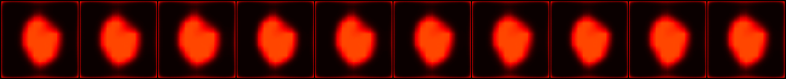
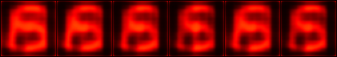
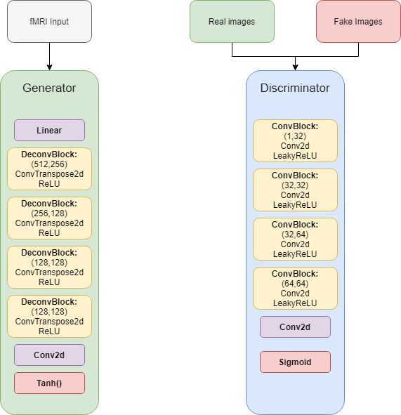

# fMRI-to-Image Decoding
Image reconstruction from fMRI using a Generative Adversarial Network in PyTorch. A group project for my MSc course 'Biodata analysis'.

### Training gifs for different datasets

['69'](https://data.donders.ru.nl/collections/di/dcc/DSC_2018.00112_485?0):

[BRAINS](https://data.donders.ru.nl/collections/di/dcc/DSC_2018.00114_120?1):

[Neuro](http://brainliner.jp/data/brainliner/Visual_Image_Reconstruction):

### GAN architecture

